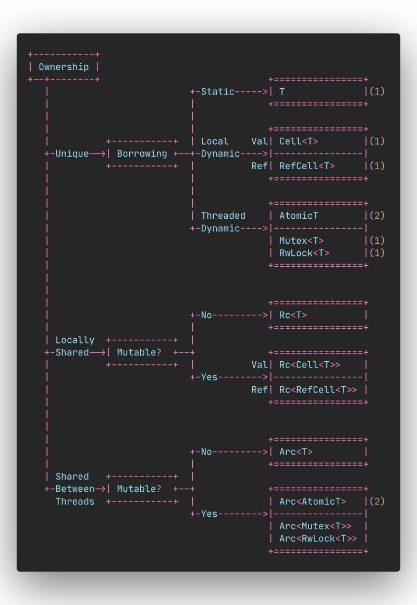

[[LIFETIME]]

[[SEMANTIC]]

[[OWNERSHIP]]

---

> It underpins the term **fearless concurrency**

> Borrow checking relies on three interrelated concepts—**lifetimes, ownership, and borrowing**:

> Ownership: the notion of ownership is rather limited. **An owner cleans up when its values’ lifetimes end.**

> For example, *when a function returns, the memory holding its local variables needs to be freed*. 
Owners cannot prevent other parts of the program from accessing their values or report data theft to some overarching Rust authority.the term move means something very specific within Rust. Nothing physically moves.Movement within Rust code **refers to movement of ownership**, rather than the movement of data. 
Ownership is a term used within the Rust community to <u>refer to the compile-time process that checks</u> that every use of a value is valid and that every value is destroyed cleanly.
ownership system provides a route to memory safety without needing a garbage collector. 

> Four general strategies can help with **ownership issues**:

    - ==Use references== where full ownership is not required.
    - **Duplicate** the value.
    - **Refactor** code to reduce the number of long-lived objects.
    - **Wrap** your data in a type designed to assist with movement issues.

> To borrow: there is no obligation to return the value to its owner. Its meaning is used to emphasize that while values can have a **single owner**, it’s possible for many parts of the program to **share access** to those values.

---

> The borrow checker checks that all access to data is legal, which allows Rust to prevent safety issues. Learning how this works will, at the very least, speed up your development time by helping you avoid run-ins with the compiler. More significantly though, learning to work with the borrow checker allows you to build larger software systems with confidence.

> It underpins the term fearless concurrency.

## Borrowing Rules

* A reference may not live longer than what it referred to. This is obvious, since if it did, it would be referring to a garbage value.
* If there's a mutable reference to a value, no other references, either mutable or immutable references, are allowed to the same value in that scope. A mutable reference is an exclusive borrow.
* If there is no mutable reference to a thing, any number of immutable references to the same value are allowed in the scope.

---

> To borrow a value means to access it. This terminology is somewhat confusing as there is no obligation to return the value to its owner. Its meaning is used to emphasize that while values can have a single owner, it’s possible for many parts of the program to share access to those values.

## Ownership

> Ownership is the methodology we use to handle **memory safely without a garbage collector**.

[[Ownership]] has a particular meaning within Rust. An owner is able to make any changes to the data and is responsible for deleting values that it owns when it leaves scope.

The ownership rule of Rust states the following principles:

> When you create a value or a resource using the **let** statement and assign it to a variable, the variable becomes the owner of the resource When the value is reassigned from one variable to another, **the ownership of the value moves to the other variable and the older variable becomes invalid** for further use The value and the variable are deallocated at the end of their scope.

> The ownership rule prevents you from having multiple points of access for modifying the value, which can lead to use after free situations, even in single threaded contexts with languages that permit multiple mutable aliases for values.

> The drop and write {} method comes from the Drop trait, which is implemented for most heap allocated types in Rust and makes automatic freeing of resources a breeze.

---

## Glossery

  > `aliasing`: Having several immutable references (&T) to the object (Rc).

  
  > `mutability`: Having one mutable reference (&mut T) to the object (mut Refcell).
