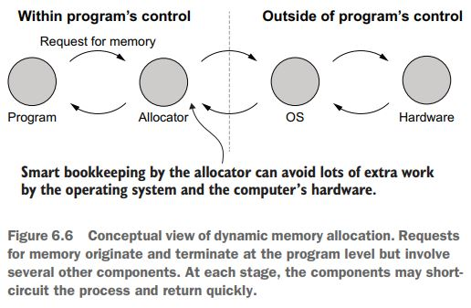
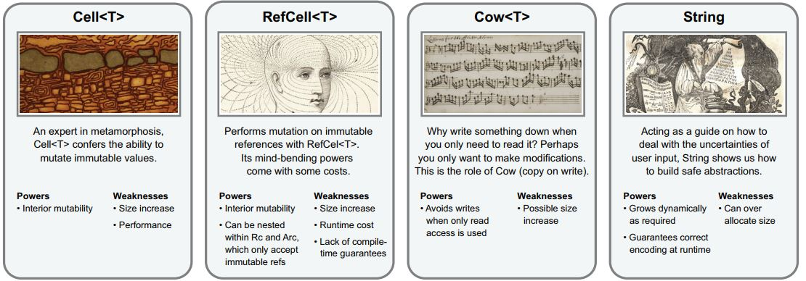
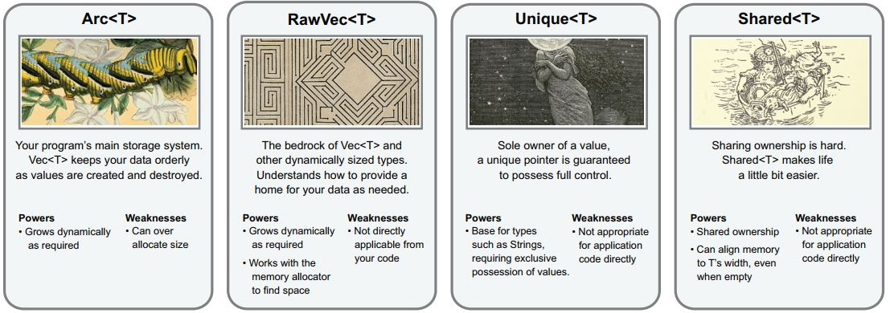

[[ria-pointer]]

[[SMARTPOINTER]]

> What are the differences between references, pointers, and memory addresses?

- **A memory address**, often shortened to address, is a number that happens to *refer to a single byte in memory*. Memory addresses are abstractions *provided by assembly languages*.
>> Used **for types** where it’s important to make their **unsafe** nature explicit.

- **A pointer**, sometimes expanded to raw pointer, is a memory address that ==points to a value of some type==. Pointers are abstractions provided by *higher-level languages*.
>> Refer to something more **primitive**. This also includes the implication that **we are responsible** for maintaining safety. (There is an implied connotation of being **unsafe**.)

- **A reference** *is a pointer*, or in the case of *dynamically sized types*, a pointer and an integer with extra guarantees. References are abstractions *provided by Rust*.
>> References—Signal that the **Rust compiler** will provide its **safety guarantees**.
  - > References always ==refer to valid data==.
  - > References are correctly aligned to ==multiples of usize==.
  - > Rust ensures that *a length* is kept alongside the *internal pointer*. That way Rust can ensure that the program never overruns the type’s space in memory.

## Reference vs Pointer

> A reference is like a pointer in that it’s an address we can follow to access data stored at that address that is owned by some other variable. Unlike a pointer, a reference is guaranteed ==to point to a valid value of a particular type==

## Special pointers

In addition, the following tools can also be handy in certain situations:
- Deeply interlinked data structures can benefit from **std::rc::Weak and std::arc::Weak** for single and multi-threaded programs, respectively. These allow access to data within an **Rc/Arc without incrementing its reference count**. This can prevent never-ending cycles of pointers.
- The **alloc::raw_vec::RawVec** type underlies Vec<T> and **VecDeq<T>.** An expandable, double-ended queue that hasn’t appeared in the book so far, it understands how **to allocate and deallocate memory in a smart way** for any given type.
- The std::cell::UnsafeCell type sits behind both Cell<T> and RefCell<T>. If you would like to provide interior mutability to your types, its implementation is worth investigating.

---

---

## Pointer Definations

## Glossery

### [[smart_pointer]]
e.q wrapper type. Rust’s smart pointer types tend to wrap raw pointers and bestow them with added semantics.

### fat pointer Vs thin pointer
The term **fat** pointer refers to **memory layout**. 
**Thin** pointers, such as **raw pointers**, are *a single usize wide*. 
Fat pointers are usually *two usize* wide,and occasionally more
