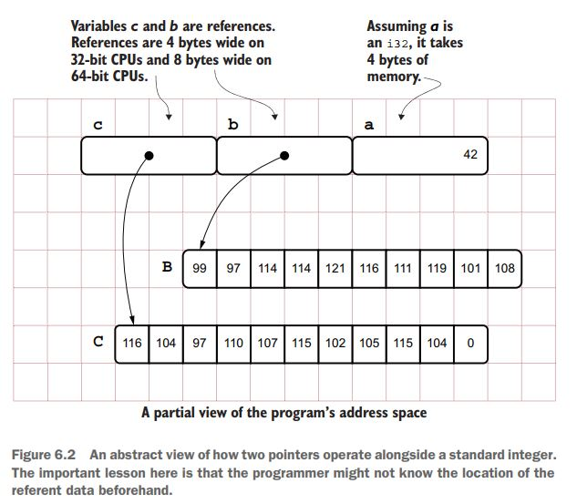
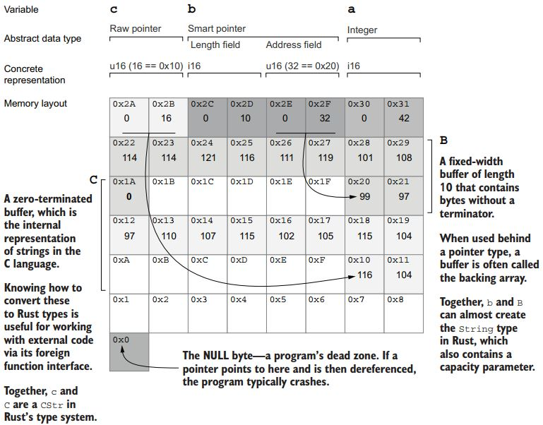

[[ria-pointer]]

[[rd-pointer]]

[[SMARTPOINTER]]

---

> What are the differences between references, pointers, and memory addresses?

- **A memory address**, often shortened to address, is a number that happens to *refer to a single byte in memory*. Memory addresses are abstractions *provided by assembly languages*.
> > Used **for types** where it’s important to make their **unsafe** nature explicit.

- **A pointer**, sometimes expanded to raw pointer, is a memory address that *points to a value of some type*. Pointers are abstractions provided by *higher-level languages*.
> > Refer to something more **primitive**. This also includes the implication that **we are responsible** for maintaining safety. (There is an implied connotation of being **unsafe**.)

- **A reference** *is a pointer*, or in the case of *dynamically sized types*, a pointer and an integer with extra guarantees. References are abstractions *provided by Rust*.
>> References—Signal that the **Rust compiler** will provide its **safety guarantees**.
  - > References always **refer to valid data**.
  - > References are correctly aligned to **multiples of usize**.
  - > Rust ensures that *a length* is kept alongside the *internal pointer*. That way Rust can ensure that the program never overruns the type’s space in memory.

## Reference vs Pointer

> A reference is like a pointer in that it’s an address we can follow to access data stored at that address that is owned by some other variable. 
>> **Unlike a pointer, a reference is** *guaranteed to point to a valid value of a particular type.*

## AsRef

```rust,no_run,compile_fail
    fn data(&self) -> &T {
        self.data.as_ref()
        //&self.data; Equal line above
    }
```    
## Special pointers

In addition, the following tools can also be handy in certain situations:
- Deeply interlinked data structures can benefit from **std::rc::Weak and std::arc::Weak** for single and multi-threaded programs, respectively. These allow access to data within an **Rc/Arc without incrementing its reference count**. This can prevent never-ending cycles of pointers.
- The **alloc::raw_vec::RawVec** type underlies Vec<T> and **VecDeq<T>.** An expandable, double-ended queue that hasn’t appeared in the book so far, it understands how **to allocate and deallocate memory in a smart way** for any given type.
- **The std::cell::UnsafeCell** type sits behind both Cell<T> and RefCell<T>. If you would like to provide interior mutability to your types, its implementation is worth investigating.

---






## usize

> [[usize]] is the memory address size for the CPU the code is compiled for. That [[CPU]] is called the compile target.

## Raw Pointer
> A [[raw_pointer]] is a memory address without Rust’s standard guarantees. These are inherently **[[unsafe]]**. For example, unlike references (&T), **raw pointers can be null**. If you’ll forgive the syntax, raw pointers are denoted as *const T and *mut T for immutable and mutable raw pointers.

- The difference between a *mut T and a *const T is minimal. These can be freely [[cast]] between one another and tend to be used interchangeably, acting as in-source documentation.

- Rust references (&mut T and &T) compile down to raw pointers. That means that it’s possible to access the performance of raw pointers **without needing to venture into unsafe blocks.**

- Raw pointers do not own their values. The Rust compiler does not check that the referent data is still valid when these are accessed.
  
- Multiple raw pointers to the same data are allowed. Every raw pointer can have write, read-write access to data. This means that there is no time when Rust can guarantee that shared data is valid.


- **It’s unavoidable**. Perhaps some OS call or third-party code requires a raw pointer. Raw pointers are common within C code that provides an external interface. (so because of this we must use raw pointer.)

- **Shared access to something is essential** and runtime performance is paramount. Perhaps multiple components within your application require equal access to some expensive-to-compute variable. If you’re willing to take on the risk of one of those components poisoning every other component with some silly mistake, then raw pointers are an option of last resort. (so because of this we must use raw pointer.)

- **Are allowed to ignore the borrowing rules** by having both immutable and mutable pointers or multiple mutable pointers to the same location
- **Aren’t guaranteed to point to valid memory**
- Are allowed to be **null**
- **Don’t implement any automatic cleanup**

### Raw Pointer Rules

> we can't cast a &T to a *mut T, as it would violate the borrowing rules that allow only one mutable borrow. so at the first we need as ` *const u8` and then ` as *mut u8`
```rust
let b_ptr = &B as *const u8 as *mut u8;
```


## Raw Poiner In Unsafe

Unsafe Rust has two new types called raw pointers that are similar to references. As with references, raw pointers can be immutable or mutable and are written as *const T and *mut T, respectively. 
> **The asterisk isn’t the dereference operator**; it’s part of the type name. In the context of raw pointers, immutable means that the pointer can’t be directly assigned to after being dereferenced.

> unsafe Notice that we don’t include the unsafe keyword in this code. We can create raw pointers in safe code; we just **can’t dereference raw pointers outside an unsafe block**, as you’ll see in a bit.    

> Creating a raw pointer to an arbitrary memory address

```rust
let mut num = 5;
let r1 = &num as *const i32;
let r2 = &mut num as *mut i32;
unsafe {
    println!("r1 is: {}", *r1);
    println!("r2 is: {}", *r2);    
}

let address = 0x012345usize;
let r = address as *const i32;
unsafe {        
    std::ptr::write(r as *mut usize, 0usize); //Memory overwrite to a address
    println!("r1 is: {}", *r);
}
```


---

You can create pointers safely from any integral value. An i32 is not a Vec<String>, but Rust is quite comfortable .ignoring that here.

```rust
let ptr = 42 as *const Vec<String>;
```

## Data Race

> It’s something that new Rustaceans struggle with, because most languages let you mutate whenever you’d like. The benefit of having this restriction is that Rust can prevent data races at compile time. A data race is similar to a race condition and happens when these three behaviors occur:

> Two or more pointers access the same data at the same time.
> At least one of the pointers is being used to write to the data.
> There’s no mechanism being used to synchronize access to the data.

> **Data races cause** [[undefined_behavior]] and can be difficult to diagnose and fix when you’re trying to track them down at runtime;

---


## Glossery

> `Size & Alignment`: For example, a value with an alignment of 2 must be stored at an even address, while a value with an alignment of 1 can be stored at any address. Alignment is measured in bytes, and must be at least 1, and always a power of 2. The alignment of a value can be checked with the align_of_val function.The unit tuple (()), which is guaranteed as a zero-sized type to have a size of 0 and an alignment of 1.the type [u16; 0] has size 0 and alignment 2). The size of a value can be checked with the size_of_val function.

> `&mut T`: This means that &mut T types do **not implement the Copy** trait.

> `&T`: A pointer is a **Copy** type, which simply means you can have many immutable references to a value T.

> `&`:	borrow

> `*`:	dereference

> Rust has a feature called automatic referencing and dereferencing.Calling methods is one of the few places in Rust that has this behavior. Rust doesn’t have an equivalent to the -> operator; 
>
> Here’s how it works: when you call a method with object.something(), Rust automatically adds in &, &mut, or * so object matches the signature of the method. In other words, the following are the same:


```rust,compile_fail,no_run
p1.distance(&p2);
(&p1).distance(&p2);
```

> `smart_pointer` e.q wrapper type. Rust’s smart pointer types tend to wrap raw pointers and bestow them with added semantics.

> `fat pointer Vs thin pointer` : The term **fat** pointer refers to **memory layout**. **Thin** pointers, such as **raw pointers**, are *a single usize wide*. Fat pointers are usually *two usize* wide,and occasionally more

> `tags` [[smart_pointer]] [[fat_pointer]] [[data_race]]
