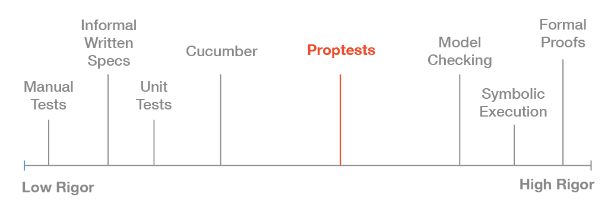

---


- Unit tests are often put in a nested module.
- This lets you unit test private helpers.
- The #[cfg(test)] attribute is only active when you run cargo test.

```rust
fn helper(a: &str, b: &str) -> String {
    format!("{a} {b}")
}

pub fn main() {
    println!("{}", helper("Hello", "World"));
}

#[cfg(test)]
mod tests {
    use super::*;

    #[test]
    fn test_helper() {
        assert_eq!(helper("foo", "bar"), "foo bar");
    }
}
```

## Differences between QuickCheck and Proptest
> QuickCheck and Proptest are similar in many ways: 
both generate **random inputs** for a function to **check certain properties**, and automatically **shrink inputs** to minimal failing cases.

The one big difference is that **QuickCheck generates and shrinks values based on type alone**, whereas Proptest uses explicit Strategy objects. The QuickCheck approach has a lot of disadvantages in comparison:

QuickCheck can only define one generator and shrinker per type. If you need **a custom generation strategy**, *you need to wrap it in a newtype and implement traits on that by hand. In Proptest,* you can define arbitrarily many different strategies for the same type, and there are plenty built-in.

*For the same reason, QuickCheck has a single “size” configuration that tries to define the range of values generated. If you need an integer between 0 and 100 and another between 0 and 1000, you probably need to do another newtype. In Proptest, you can directly just express that you want a 0..100 integer and a 0..1000 integer.*

Types in QuickCheck are not easily composable. Defining Arbitrary and Shrink for a new struct which is simply produced by the composition of its fields requires implementing both by hand, including a bidirectional mapping between the struct and a tuple of its fields. In Proptest, you can make a tuple of the desired components and then prop_map it into the desired form. Shrinking happens automatically in terms of the input types.

Because constraints on values cannot be expressed in QuickCheck, generation and shrinking may lead to a lot of input rejections. 
**Strategies in Proptest are aware of simple constraints and do not generate or shrink to values that violate them.**


|   Features    |   QuickCheck  |    Proptest   |  
|:-------------:|:-------------:|:-------------:|
| Random Input  |     *         |        *      |
| Shrink inputs |     *         |        -      |
|    Performance/Speed   |       Great       |        Good      |
|    Perform   |       Stateless       |        Full-state      |
|    Shrink values   |     *         |        -      |
| Generation/Shrink strategy |     per-type/specific type         |       per-value/Custom generator(constraint)      |


## Unit vs Integration Test
As the name suggests, these test the public API of a service/crate. These tests are used to test the functionalities of a program. **Integration tests are placed in separate files, unlike the unit tests, which are present in the same file.** Additionally, integration tests are useful for ensuring the public APIs don’t change and the expected usage of the program is not broken. *These tests reside in tests folder in the root of the crate*


## Black vs white boxes

In this case, the parse method belongs to the public interface, so the test is a *black-box* test, meaning it only uses the **public API** of your crate. **Black-box tests usually belong in one or more files in the tests subdirectory** of your crate. A good convention is to have one test file per module to make it easy to find the corresponding tests.

Sometimes, it makes sense to test **private functionality to better pinpoint a bug or regression**. Those tests are called *white-box* tests. Because they need to access the crate internals, they must be defined within the crate. The best practice is to **include a test submodule** directly in your crate and only compile it under test, like so:

```rust, no_run, compile_fail
#[cfg(test)]
mod test {
    use super::{parse_inner, check};

    #[test]
    fn test_parse_inner() { .. }

    #[test]
    fn test_check() { .. }
}
```