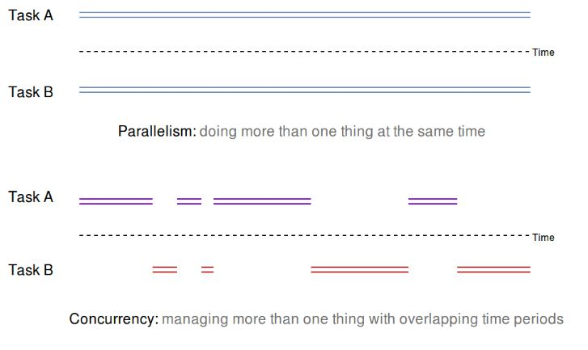
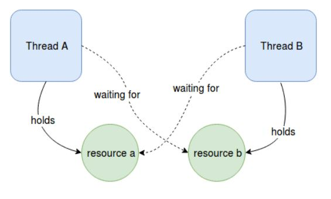

[[RACE]]

[[RAYON]]

[[MPSC]]

[[ATOMIC]]

[[THREAD-TIME]]

[[UNSAFE-THREAD]]

[[THREAD-SHAREDSTATE]]
---

> Rc<T> is not thread-safe. In multithreaded code, it’s much better to replace Rc<T> with Arc<T> and Rc<RefCell<T>> with Arc<Mutex<T>>. [[Arc]] stands for #atomic_reference_counter.


# Thread





> Which parts of your code on different threads will run. This can lead to problems, such as:

- Race conditions, where threads are accessing data or resources in an inconsistent order
- Deadlocks, where two threads are waiting for each other to finish using a resource the other thread has, preventing both threads from continuing
- Bugs that happen only in certain situations and are hard to reproduce and fix reliably

> Programming languages implement threads in a few different ways:
> APIs to create threads is sometimes called 1:1, meaning one operating system thread per one language thread.the green-threaded model is called the M:N model: there are M green threads per N operating system threads, where M and N are not necessarily the same number.
> The green-threading M:N model requires a larger language runtime to manage threads.
> As such, the Rust standard library only provides an implementation of 1:1 threading.
> Because Rust is such a low-level language, there are crates that implement M:N threading if you would rather trade > overhead for aspects such as more control over which threads run when and lower costs of context switching, for example.

> Blocking a thread means that thread is prevented from performing work or exiting.

> you can divide a calculation into independent parts, split those parts across threads, and then use a Mutex<T> to have each thread update the final result with its part.

## Thread•Spawning
>Threads are the primary mechanism that operating systems provide for enabling concurrent execution. Modern operating systems ensure that each thread has fair access to the CPU. Understanding how to create threads (often referred to as spawning treads) and understanding their impact are fundamental skills for programmers wanting to make use of multi-core CPUs.

> threads “don’t scale.” What does that mean?
>Every thread requires its own memory, and by implication, we’ll eventually exhaust our system’s memory. Before that terminal point, though, thread creation begins to trigger slowdowns in other areas. As the number of threads to schedule increases, the OS scheduler’s work increases. When there are many threads to schedule, deciding which thread to schedule next takes more time.
> Spawning threads is not free. It demands memory and CPU time. Switching between threads also invalidates caches.

> if you’re thinking that sleeping is not a representative workload, It asks each thread to enter a spin loop. spin loop sterategy is better(performance) than sleep strategy.

> It’s also possible to use both: sleep for the bulk of the time and a spin loop towards the end.
> Second, CPU-intensive multithreading doesn’t scale well past the number of physical cores.

### Thread•Spawin•Move•Capture
> The move closure is often used alongside thread::spawn because it allows you to use data from one thread in another thread.

> we’re not using any data from the main thread in the spawned thread’s code. To use data from the main thread in the spawned thread, the spawned thread’s closure must capture the values it needs.

> The move keyword overrides Rust’s conservative default of borrowing; it doesn’t let us violate the ownership rules.

> move closures may still implement Fn or FnMut, even though they capture variables by move. This is because the traits implemented by a closure type are determined by what the closure does with captured values, not how it captures them

> When the spawned thread wants to access variables that are defined in the parent’s scope, called a capture, Rust often complains that captures must be moved into the closure. To indicate that you want to move ownership, anonymous functions take a move keyword:
```rust,no_run
use std::{thread, time};
thread::spawn(move || {
    // ...
});
```

### Thread•Spawning•Join

> join is an extension of the thread metaphor. When threads are spawned, these are said to have forked from their parent thread. To join threads means to weave these back together again.

> In practice, join means wait for the other thread to finish. The join() function instructs the OS to defer scheduling the calling thread until the other thread finishes.

> .join()//means guarantee - waiting for All Threads to Finish Using join Handles. A JoinHandle is an owned value that, when we call the join method on it, will wait for its thread to finish.
